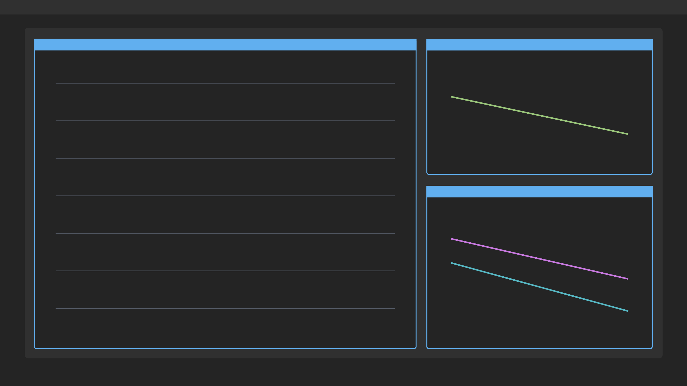
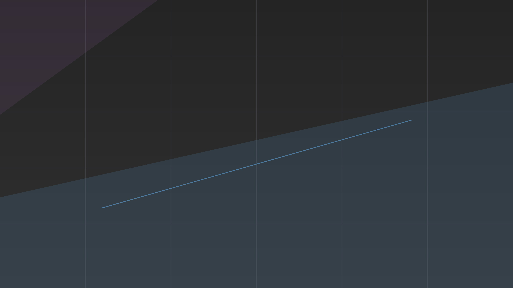
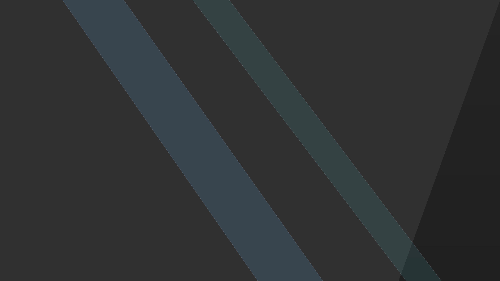
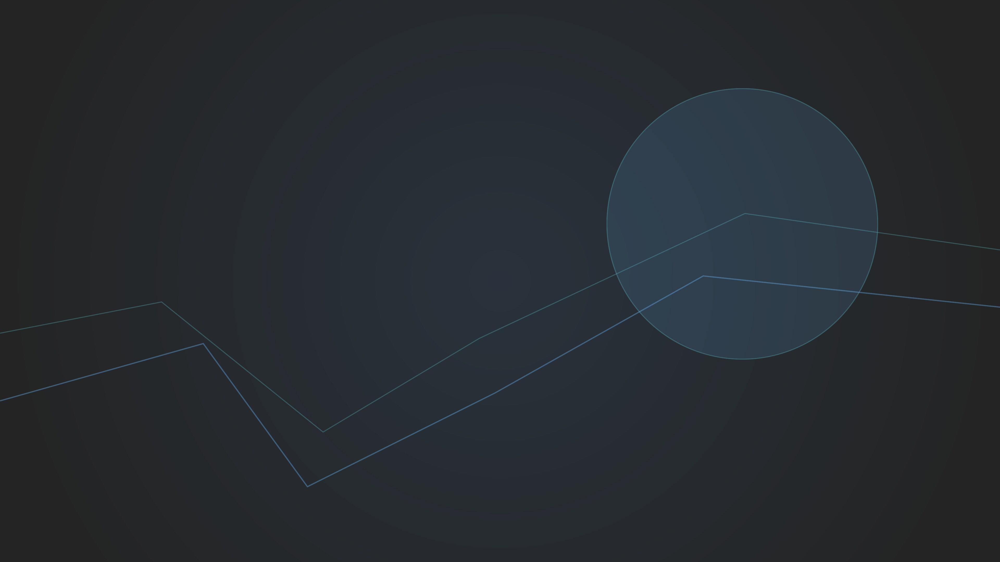
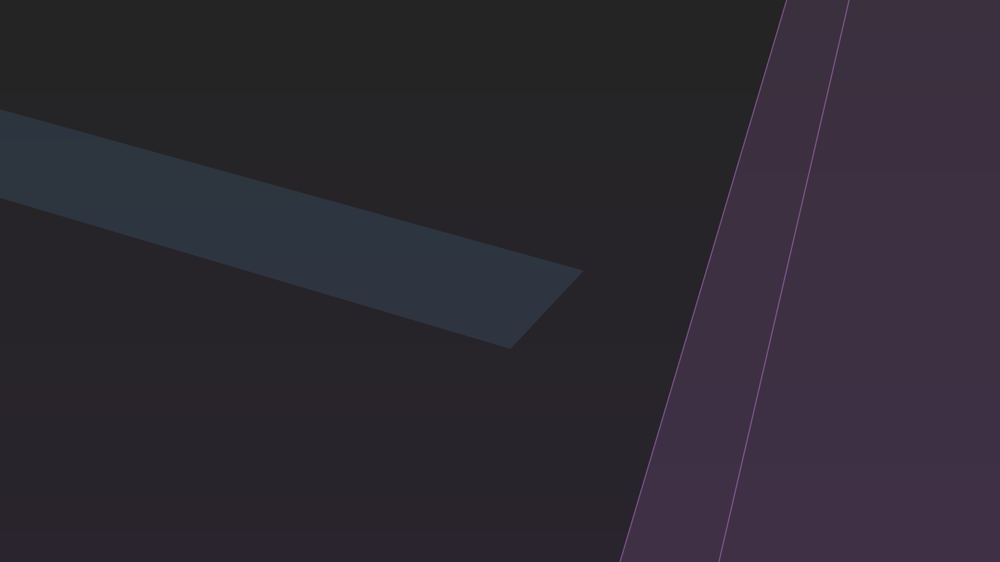
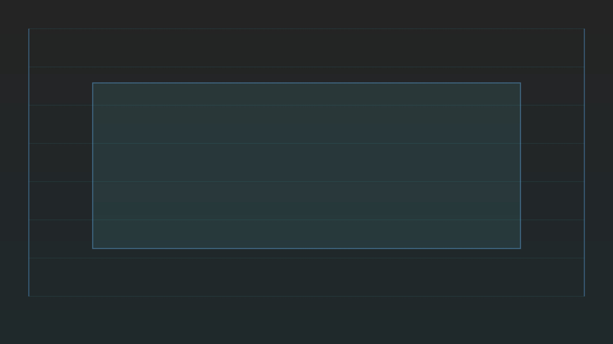
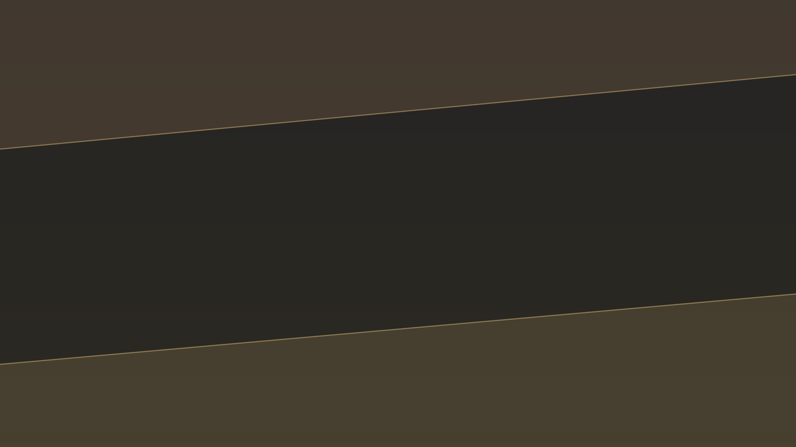
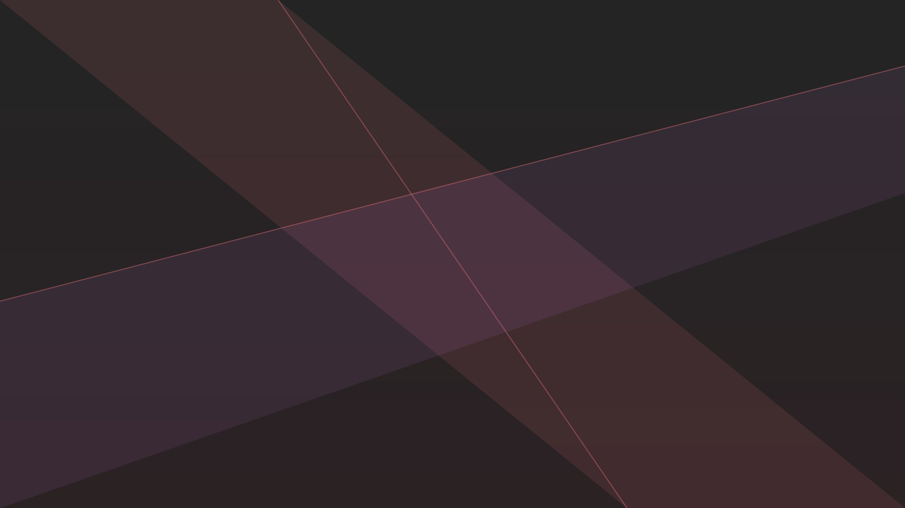
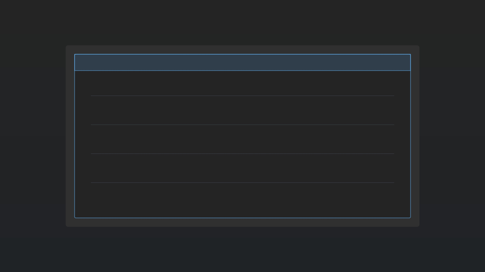

# Omarchy Noctua Theme

Neutral One Dark Pro inspired theme for Omarchy/Hyprland, built around a `#242424` base with matching terminal, UI, editor, and app theme files plus a small original wallpaper set.



## Install

Use the Omarchy theme installer:

```bash
omarchy-theme-install https://github.com/othavioquiliao/omarchy-noctua-theme
```

## What's included

- Hyprland rules and opacity tuning (`hyprland.conf`)
- Hyprlock styling (`hyprlock.conf`)
- Waybar colors (`waybar.css`) and a bundled Waybar variant (`waybar-theme/`)
- Terminals generated by Omarchy from `colors.toml`, plus Warp (`warp.yaml`)
- Shell/tools: Fish colors (`colors.fish`), fzf (`fzf.fish`)
- Apps/UI: GTK (`gtk.css`), Chromium (`chromium.theme`), Wofi (`wofi.css`), Walker (`walker.css`)
- System tools: btop (`btop.theme`), cava (`cava_theme`), mako (`mako.ini`), SwayOSD (`swayosd.css`)
- Extras: Steam (`steam.css`), Vencord (`vencord.theme.css`), icons pointer (`icons.theme`)
- Aether and Zed theme overrides (`aether.override.css`, `aether.zed.json`)

## Palette

Noctua keeps the One Dark Pro syntax family while moving the desktop base to `#242424`. The primary Omarchy accent is `#61afef`.

## Neovim note

`neovim.lua` installs `olimorris/onedarkpro.nvim` and sets LazyVim to the `onedark` colorscheme with the Noctua background override.

## Wallpapers

| | | |
| --- | --- | --- |
|  |  |  |
|  |  |  |
|  |  |  |

## Attribution

- Color base: One Dark Pro by Binaryify: <https://github.com/Binaryify/OneDark-Pro>
- Neovim theme integration: onedarkpro.nvim by olimorris: <https://github.com/olimorris/onedarkpro.nvim>
- Waybar modified from HANCORE-Linux's waybar themes: <https://github.com/HANCORE-linux/waybar-themes>
