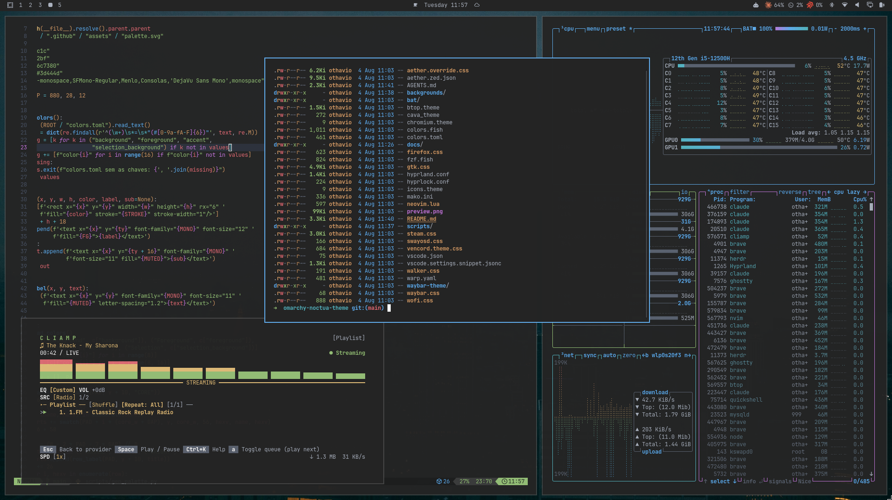
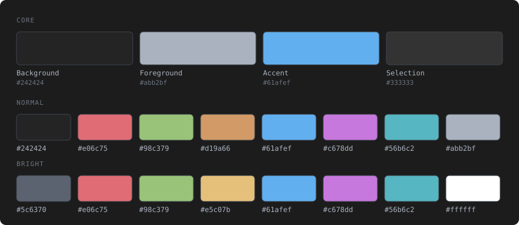
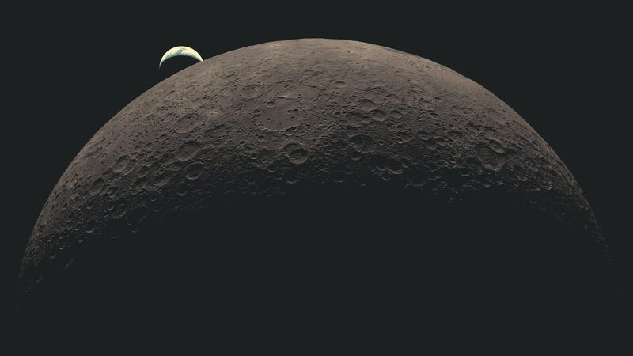

# Omarchy Noctua Theme

Neutral One Dark Pro palette for Omarchy/Hyprland, built on a `#242424` base — matching terminal, shell, editor, and app themes plus three original wallpapers.



## Install

Use the Omarchy theme installer:

```bash
omarchy-theme-install https://github.com/othavi0/omarchy-noctua-theme
```

## Palette

Noctua keeps the One Dark Pro syntax family while moving the desktop base to `#242424`. The primary Omarchy accent is `#61afef`.



## What's included

- Hyprland rules, borders, shadows and animation curves (`hyprland.conf`)
- Hyprlock styling (`hyprlock.conf`)
- Waybar colors (`waybar.css`) and a bundled Waybar variant (`waybar-theme/`)
- Terminals generated by Omarchy from `colors.toml`, plus Warp (`warp.yaml`)
- Shell/tools: Fish colors (`colors.fish`), fzf (`fzf.fish`)
- Apps/UI: GTK (`gtk.css`), Chromium (`chromium.theme`), Firefox (`firefox.css`), Wofi (`wofi.css`), Walker (`walker.css`)
- System tools: btop (`btop.theme`), cava (`cava_theme`), mako (`mako.ini`), SwayOSD (`swayosd.css`)
- Extras: Steam (`steam.css`), Vencord (`vencord.theme.css`), icons pointer (`icons.theme`)
- Aether and Zed theme overrides (`aether.override.css`, `aether.zed.json`)
- bat syntax theme (`bat/Noctua.tmTheme`, opt-in)
- VSCode theme reference (`vscode.json`) and token refinements (`vscode.settings.snippet.jsonc`, opt-in)

## Wallpapers

Click any thumbnail for the full-resolution file.

| | | |
| --- | --- | --- |
| [](backgrounds/00-city-dusk.jpg) | [](backgrounds/01-lunar-arc.jpg) | [](backgrounds/02-alpine-ridge.jpg) |
| `00-city-dusk.jpg` | `01-lunar-arc.jpg` | `02-alpine-ridge.jpg` |

## Neovim note

`neovim.lua` installs `olimorris/onedarkpro.nvim` and sets LazyVim to the `onedark` colorscheme with the Noctua background override. Comments are lifted to `#6c7380` for legibility, keywords are italic, and functions/types are bold.

## VSCode customization (opt-in)

`vscode.json` only carries the One Dark Pro extension reference because Omarchy's `omarchy-theme-set-vscode` ignores anything else. To get the same italic comments, italic keywords, and bold functions/types as Zed and Neovim, merge `vscode.settings.snippet.jsonc` into `~/.config/Code/User/settings.json` (also works for VSCodium / Cursor under their respective config paths). The block is scoped to `[One Dark Pro]` so it only fires when Noctua is active.

## bat customization (opt-in)

bat does not read theme files from Omarchy. Install the bundled tmTheme manually:

```bash
mkdir -p "$(bat --config-dir)/themes"
cp bat/Noctua.tmTheme "$(bat --config-dir)/themes/"
bat cache --build
echo '--theme="Noctua"' >> "$(bat --config-dir)/config"
```

Verify with `bat --list-themes | grep Noctua`.

## Attribution

- Color base: One Dark Pro by Binaryify: <https://github.com/Binaryify/OneDark-Pro>
- Neovim theme integration: onedarkpro.nvim by olimorris: <https://github.com/olimorris/onedarkpro.nvim>
- Waybar modified from HANCORE-Linux's waybar themes: <https://github.com/HANCORE-linux/waybar-themes>
